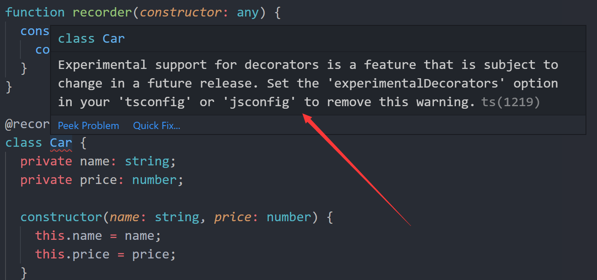
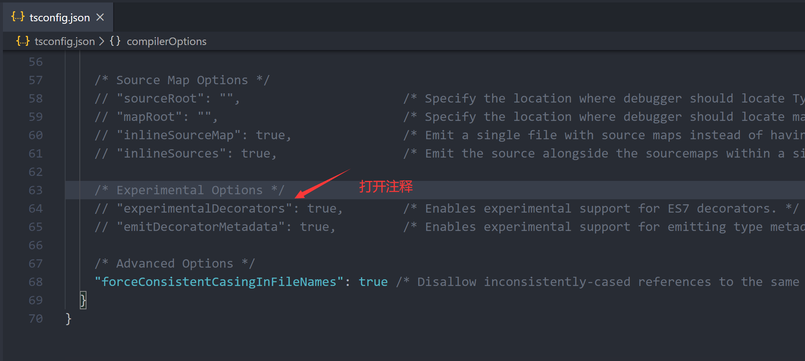
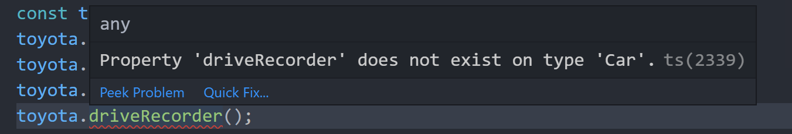
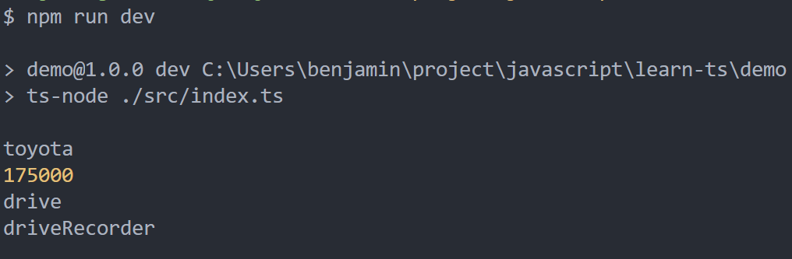

<!-- more -->

## TypeScript: 类的装饰器(一)

假设我有一个汽车工厂，每天都在生产汽车，他们都有统一的名字和价格，都可以在公路上开，那么，我们很容易写出如下代码：

> PS: 如果没有搭建 TypeScript 的开发环境，[请看这里](./2020-02-23-ts-env.md)

```typescript
class Car {
  private name: string;
  private price: number;

  constructor(name: string, price: number) {
    this.name = name;
    this.price = price;
  }

  getName() {
    console.log(this.name);
  }

  getPrice() {
    console.log(this.price);
  }

  drive() {
    console.log("drive");
  }
}

const toyota: Car = new Car("toyota", 175000);
toyota.getName();
toyota.getPrice();
toyota.drive();
```

那么，当我需要为每一辆出厂的车都安装行车记录仪器时，那么，我们可能会修改为如下代码：

```typescript
class Car {
  private name: string;
  private price: number;

  constructor(name: string, price: number) {
    this.name = name;
    this.price = price;
  }

  getName() {
    console.log(this.name);
  }

  getPrice() {
    console.log(this.price);
  }

  drive() {
    console.log("drive");
  }
  // 添加行车记录仪
  driveRecorder() {
    console.log("driveRecorder");
  }
}

const toyota: Car = new Car("toyota", 175000);
toyota.getName();
toyota.getPrice();
toyota.drive();
toyota.driveRecorder();
```

上面代码能正确执行，我们也为每辆出厂的车添加上了行车记录仪。那么，现实中行车记录仪一般都是，客户买了车后才会去安装的，也就是说，车辆在设计的时候不会考虑把一些非必要的配件都设计上，只会留出空间，让客户去安装。同理，从代码的角度 driveRecorder 这个方法不应改写进 Car 类里边，它不是在类本身的东西，是之后加上的，上面的代码显然破坏了类的设计，那么我们可以把 driveRecorder 添加到类的外面，也就是把它做成一个装饰器，装饰我们的类，那么我们的代码修改为如下：

```typescript
function recorder(constructor: any) {
  constructor.prototype.driveRecorder = () => {
    console.log("driveRecorder");
  };
}

@recorder // @recorder 为类的装饰器
class Car {
  private name: string;
  private price: number;

  constructor(name: string, price: number) {
    this.name = name;
    this.price = price;
  }

  getName() {
    console.log(this.name);
  }

  getPrice() {
    console.log(this.price);
  }

  drive() {
    console.log("drive");
  }
}

const toyota: Car = new Car("toyota", 175000);
toyota.getName();
toyota.getPrice();
toyota.drive();
toyota.driveRecorder();
```

那么，如果您直接抄上面的代码，可能会得到如下两个报错提示：

> 1.装饰器语法报错

<center>
  
</center>
通过提示我们知道，TypeScript的装饰器在ES语法中属于一个实验性值的语法，故在VSCode中会报错，如果要使用装饰器
则需要把tsconfig.json的'experimentalDecorators'的注释打开才能解除警报，如下图
<center>
  
</center>

> 2.实例调用装饰器方法报错

<center>
  
</center>
关于这个错误，我们看下装饰器

```typescript
function recorder(constructor: any) {
  constructor.prototype.driveRecorder = () => {
    console.log("driveRecorder");
  };
}
```

在 TypeScript 的类装饰器中，装饰器是一个函数，那么它的参数就是这个类，这里的 constructor 就是我们传入的 Car 类，我们用原型的方法把 driveRecorder 挂载到 constructor 而 constructor 的类型声明为 any，toyota 的类型为 Car，两个类型不一样，所以找不该 driveRecorder 方法报错，这里我们就临时改一下调用的方式(把 toyota 的类型临时改下)：

```typescript
(toyota as any).driveRecorder();
```

那么报错没了，我们运行下代码，结果是对的

<center>
  
</center>
回过头来看装饰器和原来在类中的修改，执行的结果是一样的，但编程的思想却不一样，直接在类中修改看似很方便，也是我们最容易想到的一个方式，但这只是我们在最舒适的环境下想到的，有可能，这个类不是我们写，是别人写的，那么非常不推荐大家去修改别人的代码，这里推荐使用装饰器，直接在别人写好的类上面加上，不会破坏别人的代码
