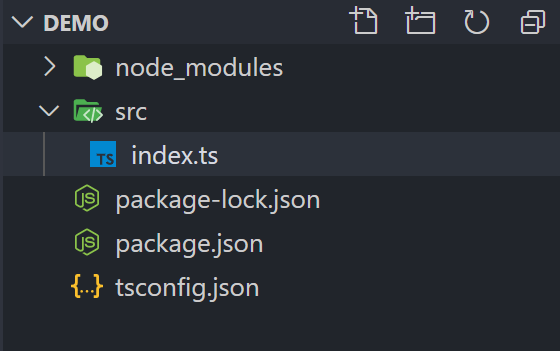

<!-- more -->

### 快速搭建 TypeScript 开发环境

---

开发 IDE 推荐使用 [Visual Studio Code](https://code.visualstudio.com/)<br/>
创建 TypeScript 的环境：创建 demo (名字任意取)文件夹，cd 到 demo 里边，执行如下命令

1.初始化 npm 包管理(如果没 npm 命令则需安装[node](https://nodejs.org/en/))

```bash
npm init -y
```

2.初始化 TypeScript 配置文件

```bash
tsc --init
```

> 如果没有 tsc 命令，则需要全局安装 tsc: npm install tsc -g

3.安装依赖

```bash
npm install ts-node typescript -D
```

> 如果下载速度过慢，则可以在后面加上淘宝镜像源加速
>
> --registry=https://registry.npm.taobao.org

然后创建 src 目录，并在目录下新建 index.ts 文件，并在 package.json 下添加 TypeScript 编译运行的命令：

```json
"script": {
  ...
  "dev": "ts-node ./src/index.ts"
}
```

此时，您的文件目录应该为如下：

<center>
  
</center>
然后我们试着在./src/index.ts下写一段代码：

```typescript
class Test {
  sayHello() {
    console.log("123");
  }
}

let t: Test = new Test();
t.sayHello();
```

然后在根目录(即 demo 目录下)，执行命令：

```bash
npm run dev
```

如果运行结果输出为：123，则开发环境搭建好了，我们就可以在 index.ts 下进行开发了
