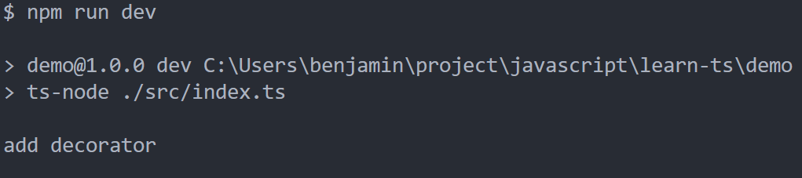

<!-- more -->

## TypeScript: 类的装饰器(二)

### 类的装饰器执行时机

接上文，我们引出了 TypeScript 类的装饰器后，接下来，去挖掘下它的特性

> PS：上文，[TypeScript: 类的装饰器(一)](./2020-02-23-ts-decorator.md)

先写一小段类的装饰器的代码：

```typescript
function addDecorator(constructor: any) {
  console.log("add decorator");
}

@addDecorator
class Test {}

const t: Test = new Test();
```

此时运行：npm run dev<br/>

<center>
  
</center>
那么，我们在加多一个Test的实例：

```typescript
function addDecorator(constructor: any) {
  console.log("add decorator");
}

@addDecorator
class Test {}

const t: Test = new Test();
const t1: Test = new Test();
```

此时运行：npm run dev<br/>

<center>
  
</center>
是不是，类的装饰器只会在第一个实例化后执行一次？我们把Test类的实例去掉，代码变为如下：

```typescript
function addDecorator(constructor: any) {
  console.log("add decorator");
}

@addDecorator
class Test {}
```

此时运行：npm run dev<br/>

<center>
  
</center>
由此可见，类的装饰器执行和实例化无关，它在类定义完成之后就会立即对类进行装饰

### 类的装饰器执行顺序

我们再加一个装饰器，代码变为如下：

```typescript
function addDecorator(constructor: any) {
  console.log("add decorator");
}

function addNextDecorator(constructor: any) {
  console.log("add next decorator");
}

@addDecorator
@addNextDecorator
class Test {}
```

此时运行：npm run dev<br/>

<center>
  
</center>
由此可见，多个类的装饰器执行顺序是由下到上，或着说离类最近的装饰器最先执行
