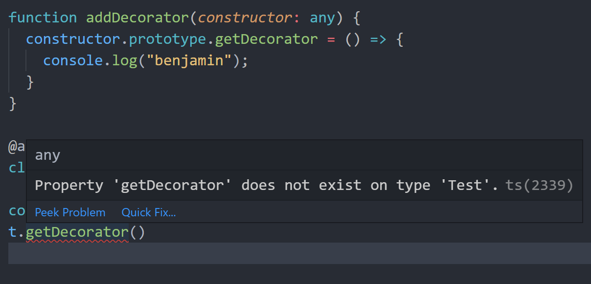
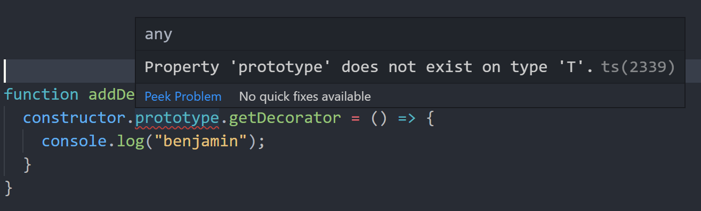
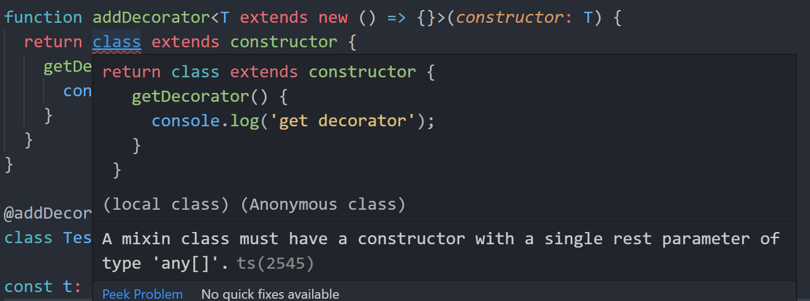
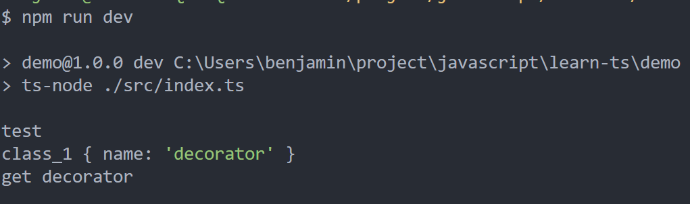
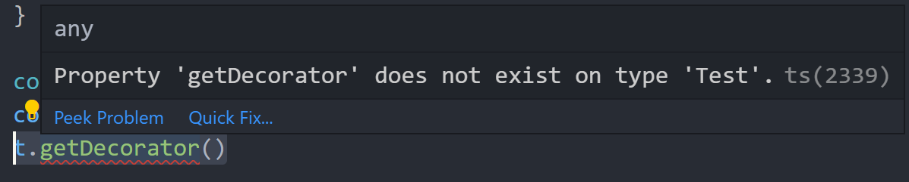
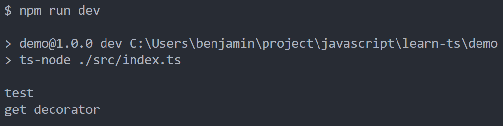

<!-- more -->

## TypeScript: 类的装饰器(三)

### 带参数的类的装饰器

学习 python 的同学应该知道，python 中也有装饰器，而且 python 中的众多框架也在大量使用装饰器，如下就是 flask 的一个典型应用

```python
from flask import Flask

app = Flask(__name__)

@app.route("/")
def hello():
    return "Hello, World!"
```

python 的装饰器是可以接收参数的，那么 TypeScript 的类的装饰器该如何接收参数，我们需要在原来的装饰器函数上再套一层函数，由这层函数接收参数：

```typescript
function addDecorator(isUse: boolean) {
  if (isUse) {
    return function(constructor: any) {
      console.log("use decorator");
    };
  } else {
    return function(constructor: any) {
      console.log("not use decorator");
    };
  }
}

@addDecorator(false)
class Test {}
```

很明显，当 addDecorator 传入 true 的时候会打印 use decorator，传入 false 的时候会打印 not use decorator

### 解决类装饰器函数参数为 any 的类型

回到类装饰器函数上：

```typescript
function addDecorator(constructor: any) {
  constructor.prototype.getDecorator = () => {
    console.log("benjamin");
  };
}

@addDecorator
class Test {}

const t: Test = new Test();
t.getDecorator();
```

那这样写，会报如下错误：

<center>
  
</center>
原因之前也讲过了，那时我们的解决办法就是将t的类型临时改变一下：

```typescript
(t as any).getDecorator();
```

这样就解决了报错，程序可以正确执行，但这不是一个很好的解决方案，我们可以采用 TypeScript 的泛型机制，把 any 改成泛型：

```typescript
function addDecorator<T>(constructor: T) {
  constructor.prototype.getDecorator = () => {
    console.log("get decorator");
  };
}
```

这样修改，又会引来如下报错：

<center>
  
</center>
原因是T这个泛型没有js的构造函数，也就没有prototype这个原型属性，那么我们可以让泛型T继承构造函数，那泛型T就有了prototype这个原型属性

> PS：构造函数 ，是一种特殊的方法。主要用来在创建对象时初始化对象， 即为对象成员变量赋初始值，总与 new 运算符一起使用在创建对象的语句中。

TypeScript 的构造函数写法如下：

```typescript
new (...args: any[]) => any
或
new (...args: any[]) => {}
```

那么整体代码改为：

```typescript
function addDecorator<T extends new (...args: any[]) => any>(constructor: T) {
  return class extends constructor {
    getDecorator() {
      console.log("get decorator");
    }
  };
}

@addDecorator
class Test {}

const t: Test = new Test();
(t as any).getDecorator();
```

来解释下这个构造函数，去掉 new，可以看出(...args: any[]) => any 就是一个函数，它接收多个类型为 any 的参数，返回类型为 any，再加上 new 就说明这是一个构造函数，那么可能有人会问，为什么构造函数要穿多个参数，我们可以把参数去掉，变为：

```typescript
new () => {}
```

那么此时会得到一个报错：

<center>
  
</center>
通过报错提示，我们知道TypeScript的构造函数必须为一个接收多个参数为any类型的函数
那么改的另外一处代码为：

```typescript
return class extends constructor {
  getDecorator() {
    console.log("get decorator");
  }
};
```

这段代码的意思是返回一个类，这个类继承了 constructor，它里面附加 getDecorator 方法，那么我们也可以在这个返回的类里边添加属性或修改属性值，代码修改如下：

```typescript
function addDecorator<T extends new (...args: any[]) => {}>(constructor: T) {
  return class extends constructor {
    name = "decorator";
    getDecorator() {
      console.log("get decorator");
    }
  };
}

@addDecorator
class Test {
  private name: string;
  constructor(name: string) {
    console.log(name);
    this.name = name;
  }
}

const t: Test = new Test("test");
console.log(t);
(t as any).getDecorator();
```

我们在 Test 类中增添了一个构造函数，它接收一个 name 的参数，然后我们在装饰器中修改了 name 的属性，运行下代码：

<center>
  
</center>
但我们依然还是没有解决any类型问题
<center>
  
</center>
那么原因是在于我们的t实例在创建的时候，它本身并没有getDecorator这个方法，它是装饰器偷偷装饰上去的，而TypeScript推断不出来，我们就需要修改一下写法：

```typescript
function addDecorator() {
  return function<T extends new (...args: any[]) => {}>(constructor: T) {
    return class extends constructor {
      name = "decorator";
      getDecorator() {
        console.log("get decorator");
      }
    };
  };
}

class Test {
  private name: string;
  constructor(name: string) {
    console.log(name);
    this.name = name;
  }
}

const t = addDecorator()(Test); // 包装一下Test类

const t1 = new t("test");
t1.getDecorator();
```

这里我们用工厂函数返回一个装饰器函数，然后用这个返回的装饰器函数去包装一下 Test 类，TypeScript 就能感知到 getDecorator 函数被添加到了 Test 类上，代码就不会有任何报错了，我们虽然没有用@的装饰器的语法，但我们也没有改变 Test 类，是装饰器的另一种实现，运行代码：

<center>
  
</center>
正确运行，没有问题
