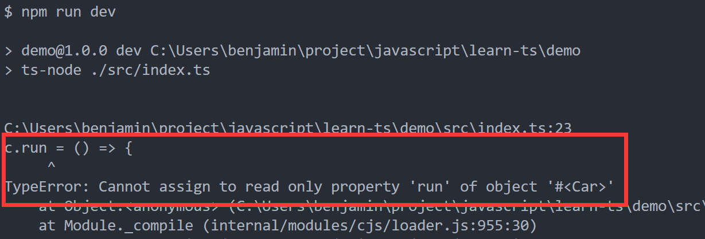

<!-- more -->

## TypeScript：方法装饰器

在讲方法装饰器之前，我们先来回顾下面向对象，在类里边，有实例方法也有静态方法，那什么是实例方法，什么又是静态方法，所谓实例方法，就是说这个方法属于实例化后的对象，静态方法是属于类，它不会因为实例化而归属于某个对象：

```typescript
class Car {
  static run() {
    console.log("static run");
  }

  run() {
    console.log("instantiation run");
  }
}

Car.run(); // 静态方法，打印出 static run

const c = new Car();
c.run(); // 实例方法，打印出 instantiation run
```

### target 参数

我们知道 TypeScript 类的装饰器可以接收一个参数，该参数为构造函数，而方法的装饰器要接收三个参数：

```typescript
// 方法装饰器
function addDecorator(
  target: any,
  key: string,
  descriptor: PropertyDescriptor
) {
  console.log(target);
}

class Car {
  @addDecorator
  run() {
    console.log("run");
  }
}
```

方法装饰器表达式会在运行时当作函数被调用，当前装饰器作用于实例方法，运行代码会打印出：

<center>
  
</center>
此时，我们发现打印target出来的是对应的是Car类的 prototype 原型对象，那我们把装饰器装饰的方法改为静态方法：

```typescript
// 方法装饰器
function addDecorator(
  target: any,
  key: string,
  descriptor: PropertyDescriptor
) {
  console.log(target);
}

class Car {
  @addDecorator
  static run() {
    console.log("run");
  }
}
```

此时代码运行的结果为：

<center>
  
</center>
此时，我们发现打印 target 出来的是对应的是Car的构造函数，那么<b>方法装饰器装饰在静态方法上，传入的target是类的构造函数，装饰在实例方法上，传入的target是类的原型对象</b>

### key 参数

再来看下第二个参数 key，我们把它打印出来看看它是什么：

```typescript
// 方法装饰器
function addDecorator(
  target: any,
  key: string,
  descriptor: PropertyDescriptor
) {
  console.log(key);
}

class Car {
  @addDecorator
  run() {
    console.log("run");
  }

  @addDecorator
  go() {}
}
```

运行结果为：

<center>
  
</center>
那么，第二个参数key传进来的就是<b>装饰的方法的名字</b>

### descriptor 参数

那 descriptor 是一个 PropertyDescriptor 的内置类型，那其实 PropertyDescriptor 对应着 JavaScript 的 [Object.defineProperty()](https://developer.mozilla.org/en-US/docs/Web/JavaScript/Reference/Global_Objects/Object/defineProp) 的第三个参数 descrideptor，通过 IDE 的功能可以发现它有以下属性，完全对应上，descrideptor 就是控制函数的属性

<center>
  
</center>
既然 descrideptor 能够控制函数的属性，那么我们来尝试下修改下被装饰的函数的属性

```typescript
// 方法装饰器
function addDecorator(
  target: any,
  key: string,
  descriptor: PropertyDescriptor
) {
  descriptor.value = () => {
    console.log("replace");
  };
}

class Car {
  @addDecorator
  run() {
    console.log("run");
  }
}

const c = new Car();
c.run();
```

value 是指被装饰的函数，这里我们重写被装饰的函数，程序运行的结果将会是我们重写后函数的值

<center>
  
</center>
除了在装饰器里边修改函数，我们也可以在函数外部修改函数，如：

```typescript
// 方法装饰器
function addDecorator(
  target: any,
  key: string,
  descriptor: PropertyDescriptor
) {}

class Car {
  @addDecorator
  run() {
    console.log("run");
  }
}

const c = new Car();
c.run = () => {
  console.log("replace");
};
c.run();
```

对于在外部覆盖原有的函数，有时候我们不希望它发生，特别是在一些底层细节上，我们希望严格一些，外面用的人它不能随意修改内部的东西，那么我们可以使用 writable :

```typescript
// 方法装饰器
function addDecorator(
  target: any,
  key: string,
  descriptor: PropertyDescriptor
) {
  descriptor.writable = false; // 设置禁止修改
}

class Car {
  @addDecorator
  run() {
    console.log("run");
  }
}

const c = new Car();
c.run = () => {
  console.log("replace");
};
c.run();
```

writable 就是设置函数的属性是否可写，这里我们设置为 false。
有了 <b>descriptor.writable = false</b> 这一行代码，我们就能有效的保护函数不被外部修改，当运行上面的代码后，会报错，并给我们明确的提示：

<center>
  
</center>
