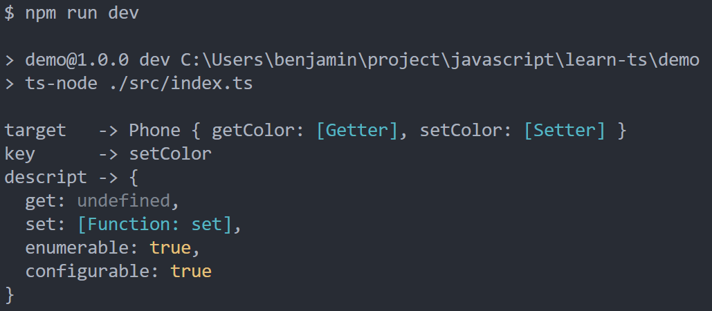
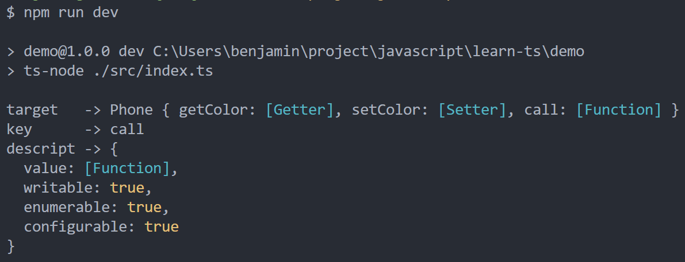

<!-- more -->

## TypeScript：访问器装饰器

### 回顾访问器

回顾学习编程的时候，碰到一些名词总是很困惑，毕竟我们自己想一个网名都要想很久，何况是一种代码规范名称，那么我们今天的主角就是 <b>访问器</b>。

> 用语言去描绘一种事物，你得先知道它是干什么的，有什么用

在类里边，有属性，有方法，那我们在实例化对象后，调用对象的属性和方法就是在访问对象的属性和方法：

```typescript
class Phone {
  public color: string = "green";
  public size: number = 15;

  call() {
    console.log("call");
  }
}

const p = new Phone();
console.log(p.color); // green
console.log(p.size); // 15
p.call(); // call
```

那我们在对象外部修改对象的属性，它也是一种访问：

```typescript
class Phone {
  public color: string = "green";
  public size: number = 15;

  call() {
    console.log("call");
  }
}

const p = new Phone();
p.color = "yellow";
console.log(p.color); // yellow
```

这就是访问的两种形式，也就对应访问器的定义的 getter 和 setter。那么访问器也是一种函数，下面我们将代码改成访问器的形式：

```typescript
class Phone {
  private _color: string = "green";

  get getColor(): string {
    return this._color;
  }

  set setColor(color: string) {
    this._color = color;
  }
}

const p = new Phone();
p.setColor = "yellow";
console.log(p.getColor);
```

可以看到访问器的定义方式是在函数前面加 get 或 set，调用方式和调用属性一样，不需要加括号。那么访问器看似和普通的属性调用一样，结果也一样，到底有什么用呢！我们看，在没有使用访问器的时候，如果属性是 public 的时候，外部可以随意访问，随意修改，而且是一步就能修改了，中间没有任何可处理的空间

```typescript
class Phone {
  public color: string = "green";
}

const p = new Phone();
p.color = "yellow";
console.log(p.getColor); // yellow
```

有了访问器，我们可以对类的属性进行一些预处理，这里，访问器相当于对属性进行一层包装，使得属性的使用性变强，如下代码，我们对对象外部修改 \_color 做了长度的限制，长度没超过 10 将不会改变 \_color 属性

```typescript
class Phone {
  private _color: string = "green";

  get getColor(): string {
    return this._color;
  }

  set setColor(color: string) {
    if (color.length < 10) {
      return;
    }
    this._color = color;
  }
}

const p = new Phone();
p.setColor = "yellow";
console.log(p.getColor); // green
```

### 访问器装饰器 VS 方法装饰器

在了解了访问器的后，我们来看访问器装饰器，那么既然访问器也是一个函数，那么它的用法和方法装饰器是一样的(参考上文 [TypeScript：方法装饰器]("./../2020-02-26-ts-decorator-func.md"))，但其中又有点区别，我们看下面代码：

```typescript
function addDecorator(
  target: any,
  key: string,
  descriptor: PropertyDescriptor
) {
  console.log("target   ->", target);
  console.log("key      ->", key);
  console.log("descript ->", descriptor);
}

class Phone {
  private _color: string = "green";

  get getColor() {
    return this._color;
  }

  @addDecorator
  set setColor(color: string) {
    this._color = color;
  }
}
```

运行代码，结果如下：

<center>
  
</center>
这里我们没有对 get 做装饰器，所以 get 是undefined

> 注意 TypeScript 不允许同时装饰一个成员的 get 和 set 访问器。取而代之的是，一个成员的所有装饰的必须应用在文档顺序的第一个访问器上。这是因为，在装饰器应用于一个属性描述符时，它联合了 get 和 set 访问器，而不是分开声明的。

看访问器的装饰器属性，我们来对比下方法装饰器的属性：

```typescript
function addDecorator(
  target: any,
  key: string,
  descriptor: PropertyDescriptor
) {
  console.log("target   ->", target);
  console.log("key      ->", key);
  console.log("descript ->", descriptor);
}

class Phone {
  private _color: string = "green";

  get getColor() {
    return this._color;
  }

  set setColor(color: string) {
    this._color = color;
  }

  @addDecorator
  call() {}
}
```

那么运行的结果如下：

<center>
  
</center>
对比结果：方法装饰器的 descriptor 有 value 和 witable 属性，但没有 get 和 set 属性；访问器装饰器有 get 和 set 属性，但没有 value 和 witable 属性。
