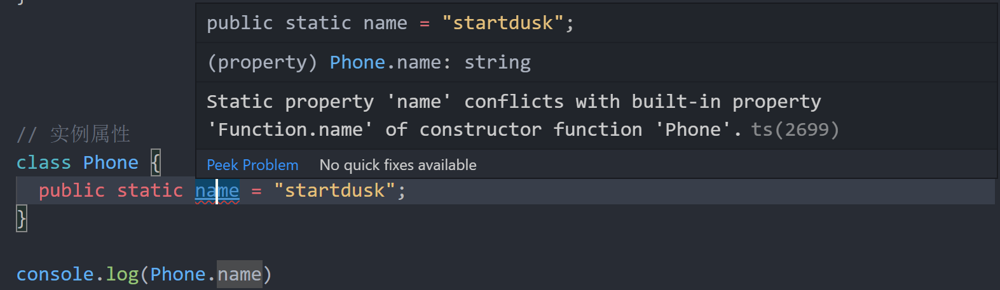
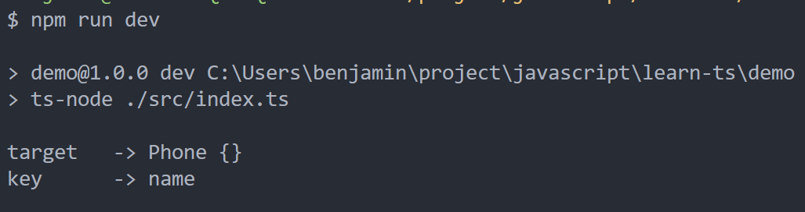
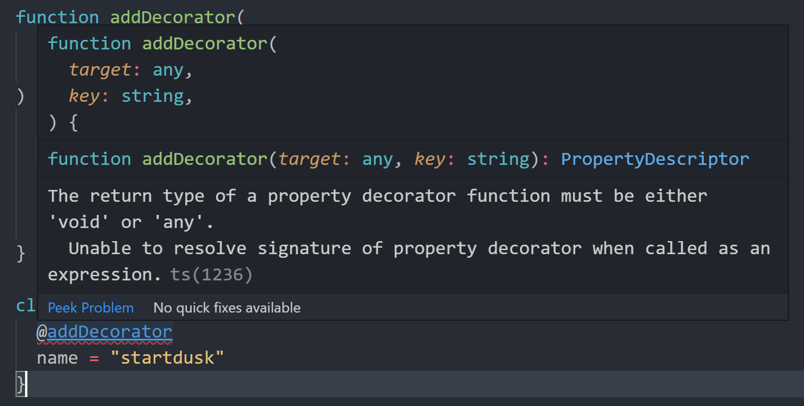
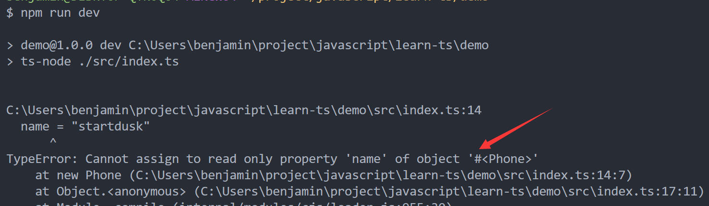

<!-- more -->

## TypeScript：属性装饰器

### 回顾类的属性

回顾面向对象，类中的属性分为实例属性和静态属性，实例属性属于实例化后的对象，静态属性属于类本身

```typescript
// 实例属性
class Phone {
  name = "startdusk";
}

const p = new Phone();
console.log(p.name); // startdusk
```

在类中，如果没有声明成员变量的访问属性，默认是 public ,如果改成 public，运行结果也是一样：

```typescript
// 实例属性
class Phone {
  public name = "startdusk";
}

const p = new Phone();
console.log(p.name); // startdusk
```

那么静态属性就有点特殊了，声明一个成员变量为静态需要加上关键字 static ，并且静态属性属于类本身，所以只能用类来访问属性而不能用对象访问

```typescript
// 静态属性
class Phone {
  public static name = "startdusk";
}

console.log(Phone.name);
```

当然上面这段静态属性的代码是有问题的，如果你使用 IDE 的敲上面这段代码，会给你报如下错误：

<center>
  
</center>
这是因为 TypeScript 的构造函数有内置的属性 name ，所以我们定义的 name 同名冲突，修改属性名即可解决：

```typescript
// 静态属性
class Phone {
  public static phoneName = "startdusk";
}

console.log(Phone.phoneName); // startdusk
```

那么细心的同学可能会发现，上面的所有代码中，所有的属性都初始化了，这点不同于 JavaScript ，在 ES6 中，写 JavaScript 中的类，你可以这样定义：

```javascript
class Phone {
  name;
}
```

可见，JavaScript 中定义类的属性，只需要声明就可以了，而 TypeScript 中不行，必须要声明后初始化：

1.直接定义后初始化

```typescript
class Phone {
  public name = "startdusk";
}
```

2.构造函数初始化

```typescript
class Phone {
  private price: number;
  constructor(price: number) {
    this.price = price;
  }
}

// 上面的代码可以简写为：
class Phone {
  constructor(private price: number) {
    this.price = price;
  }
}
```

### 使用属性装饰器

使用属性装饰器，要注意，属性装饰器它没有 descriptor 参数

```typescript
// 属性装饰器
function addDecorator(target: any, key: string) {
  console.log("target   ->", target);
  console.log("key      ->", key);
}

class Phone {
  @addDecorator
  name = "startdusk";
}
```

那么我们按照惯例运行程序

<center>
  
</center>
打印出来的结果是，target 是原型对象，key 是被装饰的属性的名字。当然，可能大家可能会疑惑我是怎么知道 target 打印出来的是原型对象，那么，可以使用如下命令，我们TypeScript转换成 JavaScript 代码看看：

```bash
tsc ./src/index.ts
```

此时就会在 src 目录下生成 index.js 文件，我们来看下：

```javascript
var __decorate =
  (this && this.__decorate) ||
  function(decorators, target, key, desc) {
    var c = arguments.length,
      r =
        c < 3
          ? target
          : desc === null
          ? (desc = Object.getOwnPropertyDescriptor(target, key))
          : desc,
      d;
    if (typeof Reflect === "object" && typeof Reflect.decorate === "function")
      r = Reflect.decorate(decorators, target, key, desc);
    else
      for (var i = decorators.length - 1; i >= 0; i--)
        if ((d = decorators[i]))
          r = (c < 3 ? d(r) : c > 3 ? d(target, key, r) : d(target, key)) || r;
    return c > 3 && r && Object.defineProperty(target, key, r), r;
  };
function addDecorator(target, key) {
  console.log("target   ->", target);
  console.log("key      ->", key);
}
var Phone = /** @class */ (function() {
  function Phone() {
    this.name = "startdusk";
  }
  __decorate([addDecorator], Phone.prototype, "name");
  return Phone;
})();
```

生成的 JavaScript 代码比较复杂，但我们重点在 \_\_decorate 函数的使用上，可以看到，它第一个参数就是装饰器列表，我们的装饰器就在这个列表里面，而第二个参数就是 Phone 的原型对象，也就是 target 参数，而 "name" 显然就是装饰的属性名，也就是 key 参数。</br>
如果，我们想实现控制属性是否可被修改(像方法装饰器有 descriptor 参数控制)，那我们就需要手动把 descriptor 引入并返回：

```typescript
function addDecorator(target: any, key: string) {
  const descriptor: PropertyDescriptor = {
    writable: false
  };

  return descriptor;
}

class Phone {
  @addDecorator
  name = "startdusk";
}

const p = new Phone();
p.name = "github";
console.log(p.name);
```

但是，上面的代码会报如下错误：

<center>
  
</center>
那么根据报错的信息就是，我们必须声明返回的类型，void 或 any，显然我们要把声明的返回类型，写为 any

```typescript
function addDecorator(target: any, key: string): any {
  const descriptor: PropertyDescriptor = {
    writable: false
  };

  return descriptor;
}

class Phone {
  @addDecorator
  name = "startdusk";
}

const p = new Phone();
p.name = "github";
console.log(p.name);
```

此时，报错消失，那么运行代码也会报错，这是对了，因为我们在属性装饰器设置了属性不可修改

<center>
  
</center>
