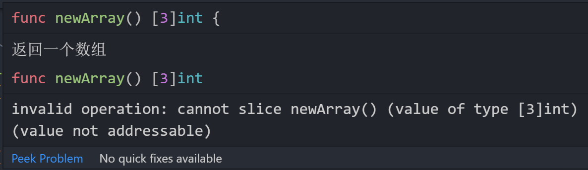

<!-- more -->

## Golang：关于寻址的一些问题

Go 语言有点像 C 语言，它有指针，用 \* 标识一个指针，用 & 标识一个地址，但 Go 语言的指针比较简单，没有指针运算。

### 字面量不可寻址

先来看一段程序代码：

```go
package main

import "fmt"

type Programmer struct {}

func (p *Programmer) FindBug() {
    fmt.Println("Yes, you are")
}

func Create() Programmer {
    return Programmer{}
}

func main() {
    Create().FindBug()
}
```

在 Go 语言中，字面量是不可以取值的，上面的结构体 Programmer 有个指针接收者的方法 FindBug ，但是，我们在函数 Create 中返回的是一个字面量的 Programmer{} 结构体，它没有地址
，所以这段代码运行会报错。</br>
解决方式： </br> 1.修改为可寻址：

```go
// 1. 让 Create 函数 返回一个地址
func Create() *Programmer {
    return &Programmer{}
}

// 2. 不改变 Create ,用变量接收 Create 的返回值
func main() {
    var c = Create()
    c.FindBug()
}
```

2.把指针接收者改为值接收者

```go
func (p Programmer) FindBug() {
    fmt.Println("Yes, you are")
}
```

### 切片和数组寻址的问题

还是先来看一段代码：

```go
package main

import "fmt"

// 返回一个长度为3的数组
func newArray() [3]int {
	return [3]int{1, 2, 3}
}

// 返回一个长度为3的slice
func newSlice() []int {
	return []int{1, 2, 3}
}

func main() {
	arr1 := newArray()[1:]
	fmt.Println("arr1: ", arr1)
	arr2 := newSlice()[1:]
	fmt.Println("arr2", arr2)
}

```

如果你使用 IDE 的话，会提示如下错误

<center>
  
</center>
很明显，字面量的数组不可寻址，上面的 newArray 调用可简化为：

```go
arr1 := [3]int{1, 2, 3}[1:] // 字面量数组寻址是不合法的
```

但是，我们先将数组赋值给变量 arr1 它就有地址了，于是我们将代码改为如下：

```go
arr1 := [3]int{1, 2, 3}
arr1 = arr1[1:]
```

这段代码也会报错，大家可以先思考下为什么会报错？</br>
报错的原因就是，数组在做切片操作的时候会变为一个 slice ，而变量 arr1 的初始类型为数组，arr1[1:] 则是一个 slice ，所以再次对 arr1 赋值的时候类型不匹配所以报错。

> PS：大家再看一些代码的时候，如 <b>变量 := 数组[:]</b> 就是把一个数组转换成一个 slice

那么，slice 字面量为什么能做切片操作(可寻址)呢？实际上 slice 内部的结构是一个结构体，也是对底层数组的一个 view。
每一个切片间接引用一个元素序列。尽管一个非空切片是不可取地址的，它的内部元素序列需要开辟在内存中的某处因而必须是可取地址的。 取一个切片的元素地址事实上是取内部元素序列上的元素地址。

这就是为什么不可寻址的非空切片的元素是也可以被取地址的。
