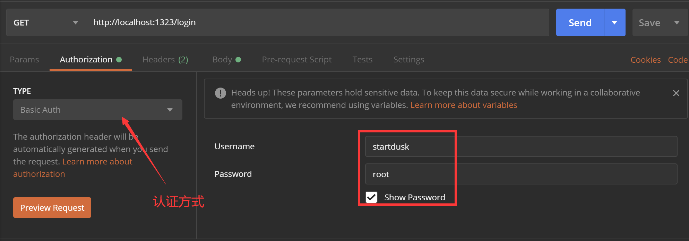
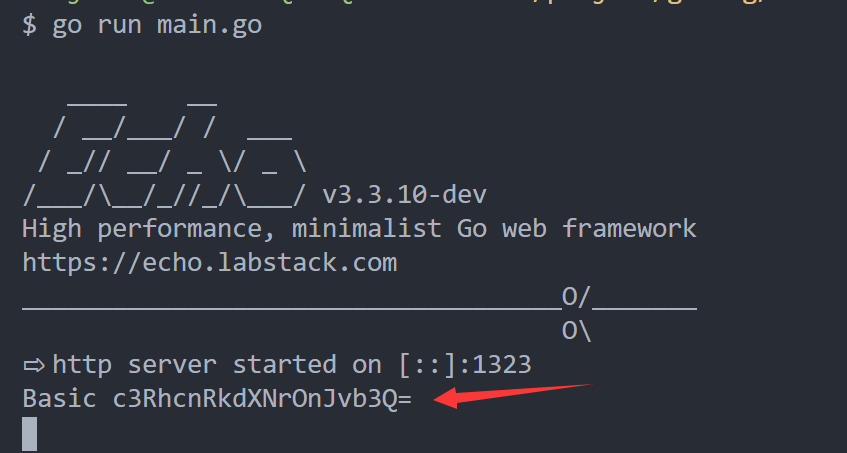
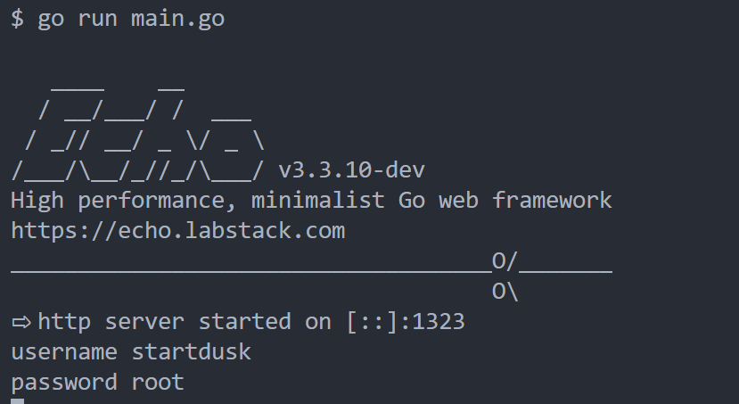
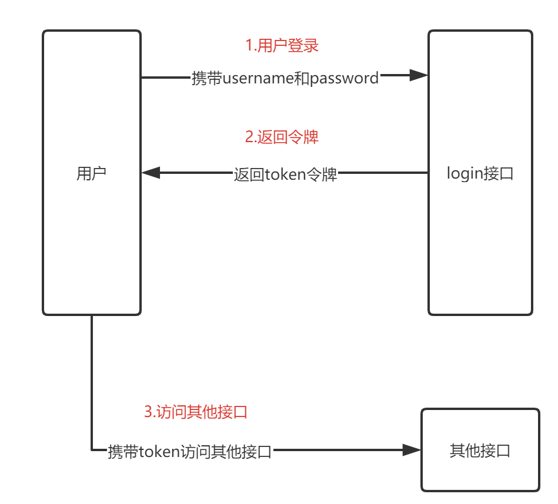
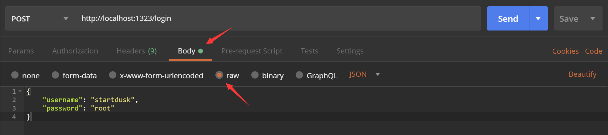
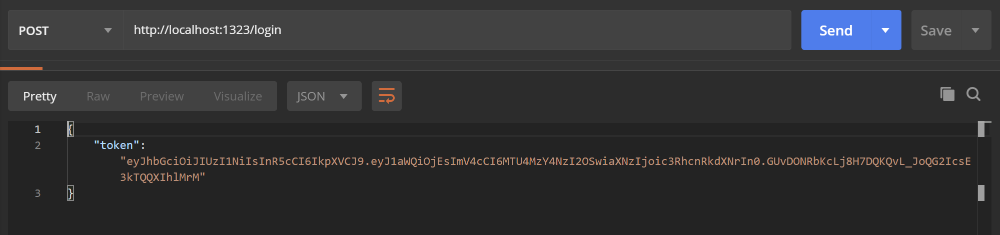
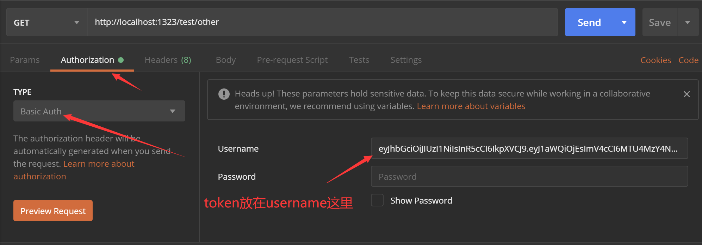
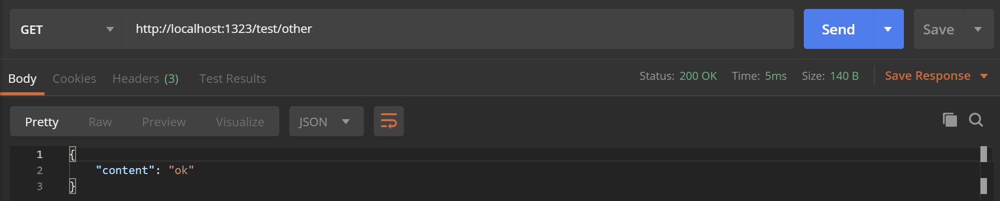
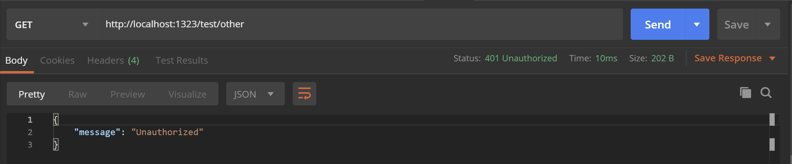

<!-- more -->

## Golang：BasicAuth + JWT 校验用户权限

### 为什么需要权限

在平常浏览网页中，大多数网站对用户分为游客和普通用户，还有会员，那么游客浏览一些网页需要登录才能看到，普通用户查看一些帖子需要积分，而会员则像是开了一条绿色通道，什么都能访问，这就是权限的作用</br>

### 使用 BasicAuth 认证

[BasicAuth](https://baike.baidu.com/item/Basic%20Auth/3097056?fr=aladdin) 是开放平台的认证方式，每次访问 API 都会携带 用户的 username 和 password 认证，那么 BasicAuth 会对 username 和 password 进行加密，那我们可以使用 PostMan 这个工具来测试 BasicAuth 的加密效果。为了测试，使用如下代码，这里，我用了[echo](https://github.com/labstack/echo)这个框架(当然也可以使用[gin](https://github.com/gin-gonic/gin)，[iris](https://github.com/kataras/iris)，[beego](https://github.com/astaxie/beego)等框架)搭建了一个 login 的接口，在 login 这个接口中，我们从请求头中获取 BasicAuth 的加密信息(在 http 请求中，对请求认证的信息是放在请求头的 Authorization 中)

```go
// main.go
package main

import (
	"fmt"

	"github.com/labstack/echo"
)

func main() {
	e := echo.New()
	e.GET("/login", login)
	e.Logger.Fatal(e.Start(":1323"))
}

func login(c echo.Context) error {
	fmt.Println(c.Request().Header.Get("Authorization"))
	return nil
}

```

运行这段代码，会在 1323 端口上进行监听，那么需要在 PostMan 中发起请求：

<center>
  
</center>

我们点击 Send 后，在运行 go 总端中会打印出， username 和 password 加密后的结果

<center>
  
</center>

那么我们怎么拿到加密后的用户名和密码？在 echo 框架中内置了简单 [BasicAuth 中间件](https://echo.labstack.com/middleware/basic-auth)，我们可以直接使用官方的实例代码改造：

```go
// 官方示例
// 这里的 username 和 password 就是我们传过来的 username 和 password
e.Use(middleware.BasicAuth(func(username, password string, c echo.Context) (bool, error) {
	// Be careful to use constant time comparison to prevent timing attacks
	if subtle.ConstantTimeCompare([]byte(username), []byte("joe")) == 1 &&
		subtle.ConstantTimeCompare([]byte(password), []byte("secret")) == 1 {
		return true, nil
	}
	return false, nil
}))
```

改造我们的代码：

```go
// main.go
package main

import (
	"fmt"

	"github.com/labstack/echo"
	"github.com/labstack/echo/middleware"
)

func main() {
	e := echo.New()
	e.Use(middleware.BasicAuth(auth))
	e.GET("/login", login)
	e.Logger.Fatal(e.Start(":1323"))
}

func auth(username, password string, c echo.Context) (bool, error) {
	fmt.Println("username", username)
	fmt.Println("password", password)
	return false, nil
}

func login(c echo.Context) error {
	fmt.Println(c.Request().Header.Get("Authorization"))
	return nil
}
```

那么再运行代码，监听 1323 端口，再用 PostMan 发一次请求：

<center>
  
</center>

此时运行的结果为

<center>
  
</center>
我们可以看到，直接把加密的结果给解密出来了，使用 BasicAuth 中间件，解密过程就不需要我们来做了，直接交给 BasicAuth 中间件就好了。那么由于我们在 auth 中返回的是false，所以这个中间件会一直认证不通过，还会给 PostMan 返回一个 json 信息：

```json
{
  "message": "Unauthorized"
}
```

之后，我们就可以使用 BasicAuth 做认证，改下 auth 的代码

```go
func auth(username, password string, c echo.Context) (bool, error) {
	if username != "startdusk" || password != "root" {
		return false, nil
	}
	return true, nil
}

```

### 使用 BasicAuth + JWT 认证

在 BasicAuth 中直接传递用户的 username 和 password 显然是不安全的，那么用户的 username 和 password 只会在用户登录的时候传递一次，那么，可以用户登录过后给用户颁发一个令牌(这个令牌里边可以写入用户的 id 等不容易被识别的东西)，然后 BasicAuth 就传递这个令牌，用户可以拿着这个令牌去访问其他接口，这样我们就避免了传递 username 和 password 的风险。</br>
这里推荐使用 [jwt-go](https://github.com/dgrijalva/jwt-go) 这个库，具体的生成 JWT 令牌代码如下：

```go

// 拓展我们要写入token的信息
type Claims struct {
	Uid int `json:"uid"` // 扩展写入用户的id
	jwt.StandardClaims
}

func genToken(uid int) (string, error) {
	secretKey := "secretKey" // 加密的key
	expiresIn := time.Duration(24 * 30) // 设置过期时间
	claims := Claims{
		Uid: uid,
		StandardClaims: jwt.StandardClaims{
			ExpiresAt: time.Now().Add(time.Hour.Truncate(expiresIn)).Unix(),
			Issuer:    "startdusk", // 签发的用户(自定义名字)
		},
	}
	tokenClaims := jwt.NewWithClaims(jwt.SigningMethodHS256, claims) // 使用sha256进行加密claims这个结构体
	token, err := tokenClaims.SignedString([]byte(secretKey)) // 生成签名
	return token, err
}

```

那我们的用户请求流程变为：

<center>
  
</center>
更据流程，我们将 login 部分的代码修改(访问 login 也改为POST的方式)：

```go


// 定义一个用户的结构体，接收用户数据
type User struct {
	Username string `json:"username"`
	Password string `json:"password"`
}

// 模拟从数据库查找用户id的过程
func findUserIDFormDB(user *User) (int, bool) {
	if user.Username != "startdusk" || user.Password != "root" {
		return 0, false
	}

	return 1, true // 这里出于简单，直接把用户startdusk的id设置为1
}

func login(c echo.Context) error {
	var u User
	err := c.Bind(&u)
	if err != nil {
		return err
	}
	id, ok := findUserIDFormDB(&u)
	if !ok {
		return errors.New("没有该用户")
	}
	token, err := genToken(id)
	if err != nil {
		return err
	}
	return c.JSON(http.StatusOK, map[string]string{
		"token": token,
	})
}
```

然后，我们再定义一个用来用 token 访问的其他接口 other ：

```go
func other(c echo.Context) error {
	return c.JSON(http.StatusOK, map[string]string{
		"content": "ok",
	})
}
```

到这步，我们既然用了 jwt 颁发令牌(即 token)，那么在 BasicAuth 中要传递的两个参数 username 和 password 只用
在一个参数中传递 token ，一般是在 username 中传递，password 不用传参数，那么 auth 部分的代码修改为：

```go
func auth(username, password string, c echo.Context) (bool, error) {
	if username == "" {
		return false, nil
	}
	extractor := basicAuthExtractor{content: username}
	token, err := request.ParseFromRequest(
		c.Request(),
		extractor,
		func(token *jwt.Token) (interface{}, error) {
			return []byte("secretKey"), nil
		})
	if err != nil {
		return false, err
	}
	uid := getIntFromClaims("uid", token.Claims)
	if uid != 1 { // 我们在生成token的时候默认id为1
		return false, nil
	}
	return true, nil
}

func getStringFromClaims(key string, claims jwt.Claims) string {
	v := reflect.ValueOf(claims)
	if v.Kind() == reflect.Map {
		for _, k := range v.MapKeys() {
			value := v.MapIndex(k)
			if fmt.Sprintf("%s", k.Interface()) == key {
				return fmt.Sprintf("%v", value.Interface())
			}
		}
	}
	return ""
}

type basicAuthExtractor struct {
	content string
}

// basicAuthExtractor 实现 request.Extractor 接口(jwt-go下的request)
func (e basicAuthExtractor) ExtractToken(*http.Request) (string, error) {
	return e.content, nil
}
```

修改后的代码完整如下：

```go
// main.go
package main

import (
	"errors"
	"fmt"
	"net/http"
	"reflect"
	"strconv"
	"time"

	"github.com/dgrijalva/jwt-go"
	"github.com/dgrijalva/jwt-go/request"
	"github.com/labstack/echo"
	"github.com/labstack/echo/middleware"
)

func main() {
	e := echo.New()
	e.POST("/login", login)
	// 设置只在/test的路径下使用BasicAuth
	test := e.Group("/test", middleware.BasicAuth(auth))
	{
		test.GET("/other", other)
	}
	e.Logger.Fatal(e.Start(":1323"))
}

func auth(username, password string, c echo.Context) (bool, error) {
	if username == "" {
		return false, nil
	}
	extractor := basicAuthExtractor{content: username}
	token, err := request.ParseFromRequest(
		c.Request(),
		extractor,
		func(token *jwt.Token) (interface{}, error) {
			return []byte("secretKey"), nil
		})
	if err != nil {
		return false, err
	}
	uid := getIntFromClaims("uid", token.Claims)
	if uid != 1 { // 我们在生成token的时候默认id为1
		return false, nil
	}
	return true, nil
}

// 解析 jwt token 方法
func getIntFromClaims(key string, claims jwt.Claims) int {
	s := getStringFromClaims(key, claims)
	value, err := strconv.Atoi(s)
	if err != nil {
		return 0
	}
	return value
}

func getStringFromClaims(key string, claims jwt.Claims) string {
	v := reflect.ValueOf(claims)
	if v.Kind() == reflect.Map {
		for _, k := range v.MapKeys() {
			value := v.MapIndex(k)
			if fmt.Sprintf("%s", k.Interface()) == key {
				return fmt.Sprintf("%v", value.Interface())
			}
		}
	}
	return ""
}

type basicAuthExtractor struct {
	content string
}

// basicAuthExtractor 实现 request.Extractor 接口(jwt-go下的request)
func (e basicAuthExtractor) ExtractToken(*http.Request) (string, error) {
	return e.content, nil
}

// 定义一个用户的结构体，接收用户数据
type User struct {
	Username string `json:"username"`
	Password string `json:"password"`
}

// 模拟从数据库查找用户id的过程
func findUserIDFormDB(user *User) (int, bool) {
	if user.Username != "startdusk" || user.Password != "root" {
		return 0, false
	}

	return 1, true // 这里出于简单，直接把用户startdusk的id设置为1
}

func login(c echo.Context) error {
	var u User
	err := c.Bind(&u)
	if err != nil {
		return err
	}
	id, ok := findUserIDFormDB(&u)
	if !ok {
		return errors.New("没有该用户")
	}
	token, err := genToken(id)
	if err != nil {
		return err
	}
	return c.JSON(http.StatusOK, map[string]string{
		"token": token,
	})
}

func other(c echo.Context) error {
	return c.JSON(http.StatusOK, map[string]string{
		"content": "ok",
	})
}

// 拓展我们要写入token的信息
type Claims struct {
	Uid int `json:"uid"`
	jwt.StandardClaims
}

func genToken(uid int) (string, error) {
	secretKey := "secretKey"
	expiresIn := time.Duration(24 * 30)
	claims := Claims{
		Uid: uid,
		StandardClaims: jwt.StandardClaims{
			ExpiresAt: time.Now().Add(time.Hour.Truncate(expiresIn)).Unix(),
			Issuer:    "startdusk",
		},
	}
	tokenClaims := jwt.NewWithClaims(jwt.SigningMethodHS256, claims)
	token, err := tokenClaims.SignedString([]byte(secretKey))
	return token, err
}

```

那么，到这里，运行代码，我们按流程测试：</br>
先登录 login 获取 token

<center>
  
</center>
获取结果如下：
<center>
  
</center>
然后，我们拿这个token去访问 other 接口：
<center>
  
</center>
测试结果：
<center>
  
</center>
我们成功的用token访问到了 other 接口，当然，我们也测试下反例：</br>

- 1.没有传 token 的情况：
  返回

```json
{
  "message": "Unauthorized"
}
```

- 2.传一个错误的 token 的情况：
  返回

```json
{
  "message": "Internal Server Error"
}
```

- 3.token 过期的情况：
  返回

```json
{
  "message": "Internal Server Error"
}
```

测试的结果是正确，当然这个错误不是太好，需要另作错误处理，使得提示更友好，那在 Go 语言中，错误处理又是一个非常重要的东西，这里就不再展开，有兴趣的同学可以试着去处理下。

### 使用 scope 区分权限

对于权限这块，我们可以简单点的方式来处理，这里使用 scope 来处理，即用数字的范围来处理权限，比如：在用户上加一个 scope 字段，它是一个数字，那么在 other 接口上也有一个 scope ，只要用户的这个 scope 比 other 接口上的 scope 的数字大，那么用户就可以访问这个接口，反之则无权限访问。</br>

那么，这个 scope 可以写入到用户的数据库中，然后用户登录的使用获取 id 和用户的 scope，在生成用户的 token 的时候将 scope 写入到用户的 token 中
那么就需要修改三处代码：

- 1. 查找用户 id 和 scope 的过程

```go
// 模拟从数据库查找用户的id和scope的过程
func findUserIDFormDB(user *User) (int, int, bool) {
    if user.Username != "startdusk" || user.Password != "root" {
      return 0, 0, false
    }

    return 1, 1, true // 这里出于简单，直接把用户startdusk的id设置为1，scope也设置为1
}
```

- 2. 生成 token 的过程中加入 scope

```go
// 拓展我们要写入token的信息
type Claims struct {
    Uid   int `json:"uid"`
    Scope int `json:"scope"`
    jwt.StandardClaims
}

func genToken(uid, scope int) (string, error) {
    secretKey := "secretKey"
    expiresIn := time.Duration(24 * 30)
    claims := Claims{
        Uid:   uid,
        Scope: scope,
        StandardClaims: jwt.StandardClaims{
            ExpiresAt: time.Now().Add(time.Hour.Truncate(expiresIn)).Unix(),
            Issuer:    "startdusk",
        },
    }
    tokenClaims := jwt.NewWithClaims(jwt.SigningMethodHS256, claims)
    token, err := tokenClaims.SignedString([]byte(secretKey))
    return token, err
}
```

- 3.修改 auth 中间件

```go
func auth(username, password string, c echo.Context) (bool, error) {
    if username == "" {
        return false, nil
    }
    extractor := basicAuthExtractor{content: username}
    token, err := request.ParseFromRequest(
        c.Request(),
        extractor,
        func(token *jwt.Token) (interface{}, error) {
            return []byte("secretKey"), nil
        })
    if err != nil {
        return false, err
    }
    uid := getIntFromClaims("uid", token.Claims)
    if uid != 1 { // 我们在生成token的时候默认id为1
        return false, nil
    }
    // 校验用户是否有权限，scope 是否大于 8
    scope := getIntFromClaims("scope", token.Claims)
    if scope < 8 {
        return false, nil
    }
    return true, nil
}
```

修改完代码后我们来试下：
先登录 login 获取 token

<center>
  
</center>
获取结果如下：
<center>
  
</center>
然后，我们拿这个token去访问 other 接口：
<center>
  
</center>
测试结果：
<center>
  
</center>

因为我们设置了用户返回的 scope 为 1，小于 8，所以会没权限访问 other 接口，那我们把 scope 改为 9 看看：

```go
// 模拟从数据库查找用户的id和scope的过程
func findUserIDFormDB(user *User) (int, int, bool) {
    if user.Username != "startdusk" || user.Password != "root" {
      return 0, 0, false
    }

    return 1, 9, true // 这里出于简单，直接把用户startdusk的id设置为1，scope也设置为9
}
```

重新测试：
先登录 login 获取 token

<center>
  
</center>
获取结果如下：
<center>
  
</center>
然后，我们拿这个token去访问 other 接口：
<center>
  
</center>
测试结果：
<center>
  
</center>
那么，当用户的scope的大于接口的scope的时候，我们就能访问到接口了，这就是简单的权限控制，后面，大家可以把auth的scope当参数传进来，灵活使用。</br>

完整代码：

```go
package main

import (
	"errors"
	"fmt"
	"net/http"
	"reflect"
	"strconv"
	"time"

	"github.com/dgrijalva/jwt-go"
	"github.com/dgrijalva/jwt-go/request"
	"github.com/labstack/echo"
	"github.com/labstack/echo/middleware"
)

func main() {
	e := echo.New()
	e.POST("/login", login)
	// 设置只在/test的路径下使用BasicAuth
	test := e.Group("/test", middleware.BasicAuth(auth))
	{
		test.GET("/other", other)
	}
	e.Logger.Fatal(e.Start(":1323"))
}

func auth(username, password string, c echo.Context) (bool, error) {
	if username == "" {
		return false, nil
	}
	extractor := basicAuthExtractor{content: username}
	token, err := request.ParseFromRequest(
		c.Request(),
		extractor,
		func(token *jwt.Token) (interface{}, error) {
			return []byte("secretKey"), nil
		})
	if err != nil {
		return false, err
	}
	uid := getIntFromClaims("uid", token.Claims)
	if uid != 1 { // 我们在生成token的时候默认id为1
		return false, nil
	}
	// 校验用户是否有权限，scope 是否大于 8
	scope := getIntFromClaims("scope", token.Claims)
	if scope < 8 {
		return false, nil
	}
	return true, nil
}

// 解析 jwt token 方法
func getIntFromClaims(key string, claims jwt.Claims) int {
	s := getStringFromClaims(key, claims)
	value, err := strconv.Atoi(s)
	if err != nil {
		return 0
	}
	return value
}

func getStringFromClaims(key string, claims jwt.Claims) string {
	v := reflect.ValueOf(claims)
	if v.Kind() == reflect.Map {
		for _, k := range v.MapKeys() {
			value := v.MapIndex(k)
			if fmt.Sprintf("%s", k.Interface()) == key {
				return fmt.Sprintf("%v", value.Interface())
			}
		}
	}
	return ""
}

type basicAuthExtractor struct {
	content string
}

// basicAuthExtractor 实现 request.Extractor 接口(jwt-go下的request)
func (e basicAuthExtractor) ExtractToken(*http.Request) (string, error) {
	return e.content, nil
}

// 定义一个用户的结构体，接收用户数据
type User struct {
	Username string `json:"username"`
	Password string `json:"password"`
}

// 模拟从数据库查找用户的id和scope的过程
func findUserIDFormDB(user *User) (int, int, bool) {
	if user.Username != "startdusk" || user.Password != "root" {
		return 0, 0, false
	}

	return 1, 9, true // 这里出于简单，直接把用户startdusk的id设置为1，scope设置为9
}

func login(c echo.Context) error {
	var u User
	err := c.Bind(&u)
	if err != nil {
		return err
	}
	id, scope, ok := findUserIDFormDB(&u)
	if !ok {
		return errors.New("没有该用户")
	}
	token, err := genToken(id, scope)
	if err != nil {
		return err
	}
	return c.JSON(http.StatusOK, map[string]string{
		"token": token,
	})
}

func other(c echo.Context) error {
	return c.JSON(http.StatusOK, map[string]string{
		"content": "ok",
	})
}

// 拓展我们要写入token的信息
type Claims struct {
	Uid   int `json:"uid"`
	Scope int `json:"scope"`
	jwt.StandardClaims
}

func genToken(uid, scope int) (string, error) {
	secretKey := "secretKey"
	expiresIn := time.Duration(24 * 30)
	claims := Claims{
		Uid:   uid,
		Scope: scope,
		StandardClaims: jwt.StandardClaims{
			ExpiresAt: time.Now().Add(time.Hour.Truncate(expiresIn)).Unix(),
			Issuer:    "startdusk",
		},
	}
	tokenClaims := jwt.NewWithClaims(jwt.SigningMethodHS256, claims)
	token, err := tokenClaims.SignedString([]byte(secretKey))
	return token, err
}

```
