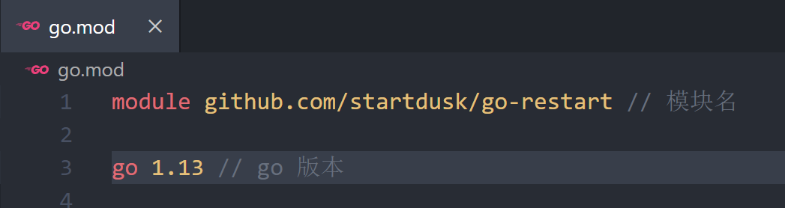

<!-- more -->

## Golang：使用 air 热重启

在 Web 开发中，热重启在很多地方都会用到，它能极大提升开发效率，在我们修改完代码后保存，就能自动重启运行得到最新的代码的运行结果，比如前端开发的 HMR 就是一个典型的例子。</br>

### Go 语言中的热重启

在 Go 语言开发中实现热重启，推荐使用 [air](https://github.com/cosmtrek/air) ，自 Go1.4 出来，官方就推荐使用 Go Modules 管理依赖，来进行模块化开发，那么我们就使用 Go Modules 构建我们的项目(注意：我使用的版本是 Go1.3)。首先创建一个项目目录如: go-restart ，然后进入目录，在该目录下执行终端命令初始化 Go Modules：

```bash
go mod init github.com/startdusk/go-restart
```

> 注意 github.com/startdusk/go-restart 只是一个模块名，你可以把它命名成其他的命名

然后就会在目录下生成一个 go.mod 文件

<center>
  
</center>

然后我们安装 [air](https://github.com/cosmtrek/air) (注意：还是在当前目录下执行)

```bash
go get -v -u github.com/cosmtrek/air
```

安装完成后，在终端执行 air ，有一下输出即为安装成功：

<center>
  
</center>
我们先创建一个 main.go 文件，写点简单代码：

```go
// main.go
package main

import "fmt"

func main() {
    fmt.Println("air test")
}
```

到这里，我们还需要创建一个 .air.conf
的配置文件(.air.conf 是默认命名)。
可以从 air 项目中的 [air_example.conf](https://github.com/cosmtrek/air/blob/master/air_example.conf) 复制配置内容，进行一些修改。
有几个要注意的地方：</br>

- 1.[build] 下的 cmd 配置默认是 go build -o ./tmp/main .，很可能你需要修改，比我当前的项目就必须修改为 go build -o ./tmp/main github.com/startdusk/go-restart/main.go
- 2.include_ext 和 exclude_dir 是配置避免监控不必要的文件和目录
- 3.如果该项目有版本管理如 git ，要把 tmp 目录加入 .gitignore 中(因为运行 air 会生成的文件放在 tmp 文件夹中)
- 4.如果出现 watch error, open tool many files…，说明要监控的文件太多，一方面确保修改了了 include_ext 和 exclude_dir，另一方面可以通过 ulimit -n 5000 调大进程允许打开的文件数

那么修改后的 .air.conf 文件就变为了：

```toml
# Config file for [Air](https://github.com/cosmtrek/air) in TOML format

# Working directory
# . or absolute path, please note that the directories following must be under root.
root = "."
tmp_dir = "tmp"

[build]
# Just plain old shell command. You could use `make` as well.
cmd = "go build -o ./tmp/main github.com/startdusk/go-restart/main.go"
# Binary file yields from `cmd`.
bin = "tmp/main"
# Customize binary.
full_bin = "APP_ENV=dev APP_USER=air ./tmp/main"
# Watch these filename extensions.
include_ext = ["go", "tpl", "tmpl", "html"]
# Ignore these filename extensions or directories.
exclude_dir = ["assets", "tmp", "vendor", "frontend/node_modules"]
# Watch these directories if you specified.
include_dir = []
# Exclude files.
exclude_file = []
# It's not necessary to trigger build each time file changes if it's too frequent.
delay = 1000 # ms
# Stop to run old binary when build errors occur.
stop_on_error = true
# This log file places in your tmp_dir.
log = "air_errors.log"

[log]
# Show log time
time = false

[color]
# Customize each part's color. If no color found, use the raw app log.
main = "magenta"
watcher = "cyan"
build = "yellow"
runner = "green"

[misc]
# Delete tmp directory on exit
clean_on_exit = true
```

此时目录结构为：

<center>
  
</center>
好了，到此我们可以在命令行运行代码：

```bash
air
```

然后输出：

<center>
  
</center>

程序成功运行，并且 air 在监听文件的变化
，那我们尝试下改动下代码：

```go
// main.go
package main

import "fmt"

func main() {
    fmt.Println("air test")
    fmt.Println("air listen")
}
```

然后控制台输出：

<center>
  
</center>

查看结果，air 成功监听到了文件的变化，并重新运行了程序。

那么，上面的粉红色的输出一些异常，大家可以去看一下这个[issue #53](https://github.com/cosmtrek/air/issues/53)，windows 平台会出现这个问题，但不是很影响使用。但这个 air 目前还不能配合 VSCode 热重启加调试模式使用(如 nodejs 的 nodemon+VSCode 是可以实现热重启加调试模式启动的)，有点遗憾。
