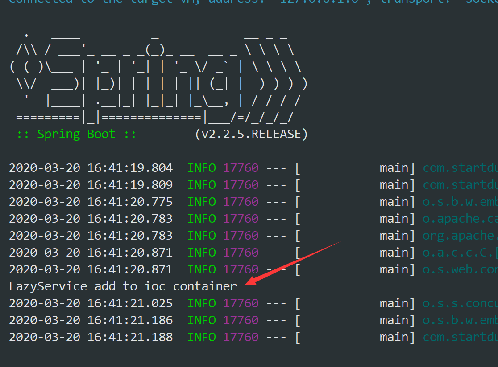
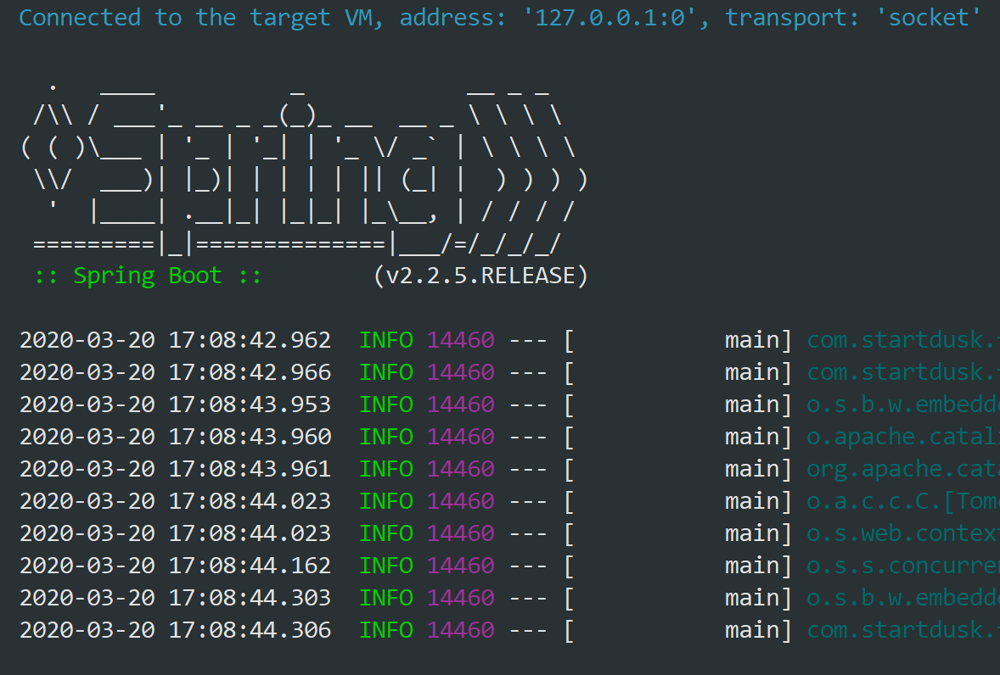
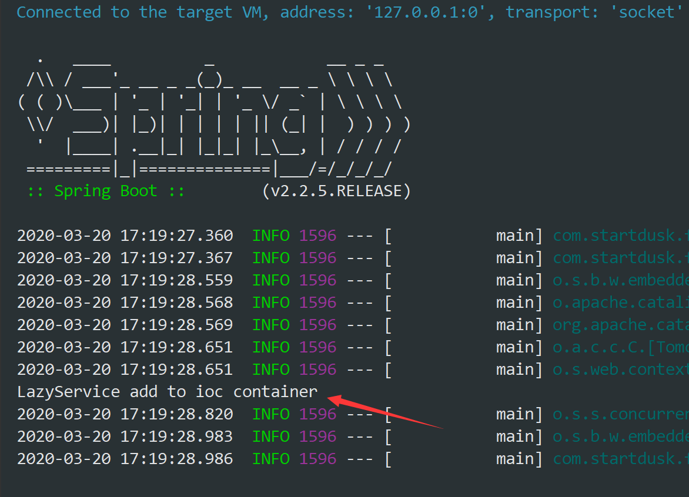
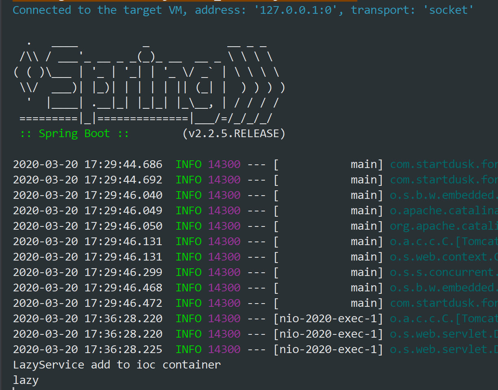

<!-- more -->

## SpringBoot：使用 @Lazy 注解懒加载

### 为什么需要懒加载？

我们知道，在 SpringBoot 应用程序启动的时候，会实例化一些对象加入到 IOC 容器里边，这个过程是非常耗时的，那我们想要减少这个耗时的过程就需要 @Lazy 注解

### 对象加入容器的时机

如下代码

```java
package com.startdusk.forgot.service;

import org.springframework.stereotype.Component;

@Service
public class LazyService {
    public LazyService() {
        System.out.println("LazyService add to ioc container");
    }

    public void print() {
        System.out.println("lazy");
    }
}
```

由于我们在 LazyService 中打上了 @Service 注解，那么当程序启动的时候，LazyService 就会被立即实例化，我们在 LazyService 写了个无参的构造函数来测试，启动程序，会打印出

<center>
  
</center>
那么说明，在打上了 @Service 注解后，在程序启动的时候就立即实例化对象加入到容器

### 使用 @Lazy 延迟加入容器

那我们来改写下代码，延迟加入容器：

```java
package com.startdusk.forgot.service;

import org.springframework.context.annotation.Lazy;
import org.springframework.stereotype.Service;

@Service
@Lazy
public class LazyService {
    public LazyService() {
        System.out.println("LazyService add to ioc container");
    }

    public void print() {
        System.out.println("lazy");
    }
}
```

再来运行一下程序：

<center>
  
</center>
看到运行的结果，并没有打印 "LazyService add to ioc container" 也就没有实例化 LazyService ，说明 @Lazy 注解起作用了，我们延迟了对象加入容器的时机

### 一个奇怪的现象

那么在实际情况中，我们会在 controller 中调用这个 service，即在 controller 中注入这个对象：

```java
package com.startdusk.forgot.api.v1;

import com.startdusk.forgot.service.LazyService;
import org.springframework.beans.factory.annotation.Autowired;
import org.springframework.web.bind.annotation.GetMapping;
import org.springframework.web.bind.annotation.RequestMapping;
import org.springframework.web.bind.annotation.RestController;


@RestController
@RequestMapping("/v1/lazy")
public class LazyController {

    @Autowired
    private LazyService lazyService;

    @GetMapping("/test")
    public String test() {
        lazyService.print();
        return "Hello, world";
    }
}

```

保持 LazyService 中的 @Lazy，我们运行程序

<center>
  
</center>
发现 LazyService 居然被实例化了，难道打上 @Lazy 注解的类被注入之后 @Lazy 就不起作用了吗？我们来看下这个 LazyController 的代码，这里其实我们也把 LazyController 加入了容器(即打上了 @RestController 注解)，在 SpringBoot 中，加入 IOC 容器就必须实例化对象，而实例化对象就要求，这个对象的里面的成员变量，方法都要被初始化，就包括 lazyService 这个要被注入的变量，即使   LazyService 打上了 @Lazy 注解。</br>

解决这个问题，我们也需要在 LazyController 打上 @Lazy 注解，才能延迟加入 IOC 容器

```java
package com.startdusk.forgot.api.v1;

import com.startdusk.forgot.service.LazyService;
import org.springframework.beans.factory.annotation.Autowired;
import org.springframework.web.bind.annotation.GetMapping;
import org.springframework.web.bind.annotation.RequestMapping;
import org.springframework.web.bind.annotation.RestController;


@RestController
@RequestMapping("/v1/lazy")
@Lazy
public class LazyController {

    @Autowired
    private LazyService lazyService;

    @GetMapping("/test")
    public String test() {
        lazyService.print();
        return "Hello, world";
    }
}

```

### @Lazy 会延迟到什么时候

会延迟到对象被调用的时候。如，运行程序，访问 localhost:8080/v1/lazy/test 就是访问 test 这个方法，那么就会调用 lazyService.print() 就会打印出：

<center>
  
</center>
我们可以看到，当被注入的对象被调用的时候，才会把对象加入 IOC 容器，然后注入对象

### 使用 @Lazy 的缺点

我们来调整下代码：
LazyService 注释掉 @Service 和 @Lazy

```java
package com.startdusk.forgot.service;

import org.springframework.context.annotation.Lazy;
import org.springframework.stereotype.Service;

// @Service
// @Lazy
public class LazyService {
    public LazyService() {
        System.out.println("LazyService add to ioc container");
    }

    public void print() {
        System.out.println("lazy");
    }
}
```

那么运行代码，再来访问下 localhost:8080/v1/lazy/test
，那么，程序会给我们抛一个错误：

```bash
Error creating bean with name 'lazyController': Unsatisfied dependency expressed through field 'lazyService';......

```

就是找不到这个这个注入的对象。那么这个报错是在程序运行中报错，而不是程序启动的时候就报错了。那么我们在 LazyController 中去掉 @Lazy

```java
package com.startdusk.forgot.api.v1;

import com.startdusk.forgot.service.LazyService;
import org.springframework.beans.factory.annotation.Autowired;
import org.springframework.web.bind.annotation.GetMapping;
import org.springframework.web.bind.annotation.RequestMapping;
import org.springframework.web.bind.annotation.RestController;


@RestController
@RequestMapping("/v1/lazy")
public class LazyController {

    @Autowired
    private LazyService lazyService;

    @GetMapping("/test")
    public String test() {
        lazyService.print();
        return "Hello, world";
    }
}
```

启动程序，那么就会在程序启动的时候直接报错，不让你运行

```bash
Field lazyService in com.startdusk.forgot.api.v1.LazyController required a bean of type 'com.startdusk.forgot.service.LazyService' that could not be found.

```
