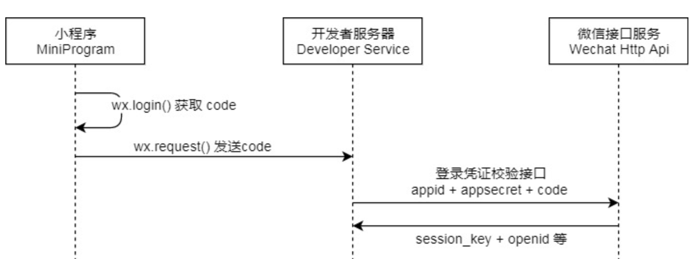
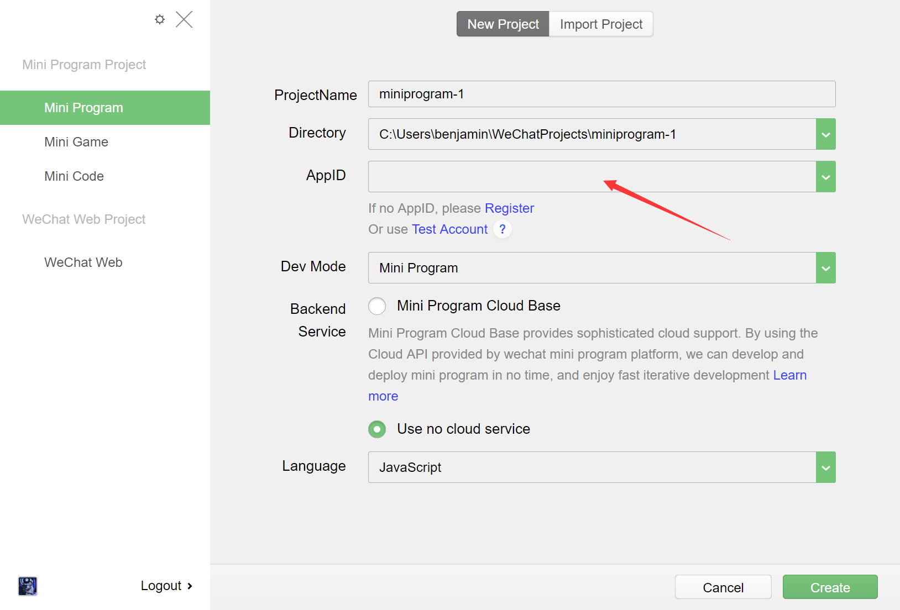
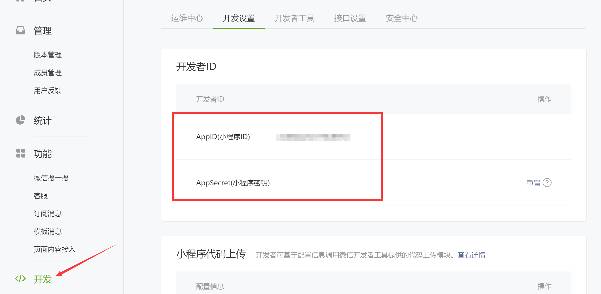
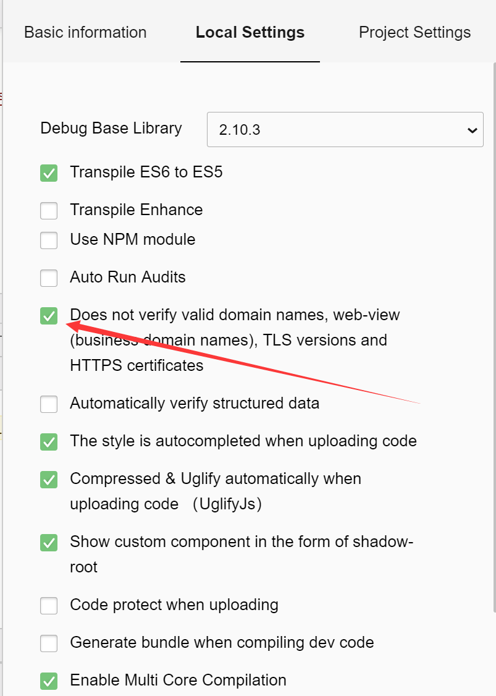
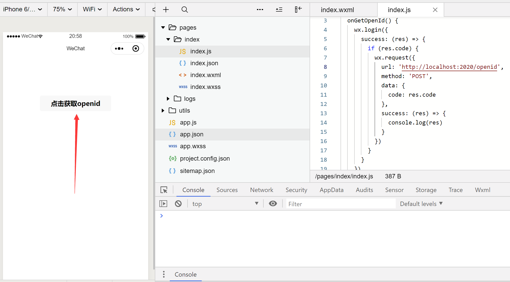
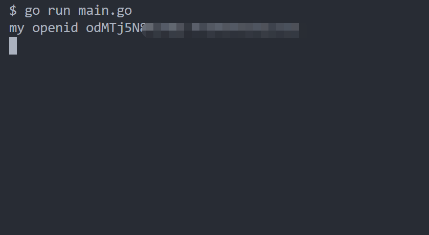

<!-- more -->

## Golang：通过小程序获取微信 openid

### 为什么要获取小程序的 openid

在开发微信小程序的过程中，小程序可以通过微信官方提供的登录能力方便地获取微信提供的用户身份标识，快速建立小程序内的用户体系。那么这个用户身份标识就是 openid。

### 小程序获取 openid 的流程

那么小程序获取 openid 的流程具体如下，这里我简化了一下，因为我们只需要获取到 openid 即可，具体可以参考[这里](https://developers.weixin.qq.com/miniprogram/dev/framework/open-ability/login.html)

<center>
  
</center>
我们需要在小程序中调用 wx.login() 获取 code 码，然后将这个 code 码发送给后端，后端带着这个 code 码和 appid，appsecret 向微信接口发起 http 请求获取 openid。

### 注意事项

在开发的小程序中的 AppID 一定要和后端使用的 AppID 保持一致，否则会获取 openid 失败

<center>
  
</center>

我们请求的微信 API 为 [auth.code2Session](https://developers.weixin.qq.com/miniprogram/dev/api-backend/open-api/login/auth.code2Session.html)，

请求地址为：

```bash
GET https://api.weixin.qq.com/sns/jscode2session?appid=APPID&secret=SECRET&js_code=JSCODE&grant_type=authorization_code
```

所需的四个参数为：

<table>
  <tr>
    <th>属性</th>
    <th>类型</th>
    <th>默认值</th>
    <th>必填</th>
    <th>说明</th>
  </tr>
  <tr>
    <th>appid</th>
    <th>string</th>
    <th></th>
    <th>是</th>
    <th>小程序 appId</th>
  </tr>
  <tr>
    <th>secret</th>
    <th>string</th>
    <th></th>
    <th>是</th>
    <th>小程序 appSecret</th>
  </tr>
  <tr>
    <th>js_code</th>
    <th>string</th>
    <th></th>
    <th>是</th>
    <th>登录时获取的 code</th>
  </tr>
  <tr>
    <th>grant_type</th>
    <th>string</th>
    <th></th>
    <th>是</th>
    <th>授权类型，此处只需填写 authorization_code</th>
  </tr>
</table>

js_code 就是我们通过 wx.login 得到的 code，grant_type 为 authorization_code，只剩下 appid 和 secret 需要我们登录[微信公总平台](https://mp.weixin.qq.com/)里面找

<center>
  
</center>

### 小程序代码演示

为了方便操作，我们在 index 页面编写了一个 button，通过 button 触发事件

```html
<!--index.wxml-->
<view class="container">
  <button bindtap="onGetOpenId">点击获取openid</button>
</view>
```

然后编写事件函数：

```js
//index.js
Page({
  onGetOpenId() {
    wx.login({
      success: res => {
        if (res.code) {
          wx.request({
            url: "http://localhost:2020/openid",
            method: "POST",
            data: {
              code: res.code
            },
            success: res => {
              console.log(res);
            }
          });
        }
      }
    });
  }
});
```

那么，在小程序中发送 http 请求强制要求地址必须为 https，由于我们在开发中，我们可以把强制 https 的设置关闭

<center>
  
</center>

### Go 语言后端代码演示

小程序发过来的数据和去微信 API 获取的数据都是放在 http body 里，所以我们要从 body 获取

```go
package main

import (
	"encoding/json"
	"fmt"
	"net/http"
)

func main() {
	http.HandleFunc("/openid", getOpenID)
	http.ListenAndServe(":2020", nil)
}

func getOpenID(writer http.ResponseWriter, request *http.Request) {
	if request.Method != http.MethodPost {
		return
	}

	var codeMap map[string]string
	err := json.NewDecoder(request.Body).Decode(&codeMap)
	if err != nil {
		return
	}
	defer request.Body.Close()

	code := codeMap["code"]
	openid, err := sendWxAuthAPI(code)
	if err != nil {
		return
	}
	fmt.Println("my openid", openid)
}

const (
	code2sessionURL = "https://api.weixin.qq.com/sns/jscode2session?appid=%s&secret=%s&js_code=%s&grant_type=authorization_code"
	appID           = "你的AppID"
	appSecret       = "你的AppSecret"
)

func sendWxAuthAPI(code string) (string, error) {
	url := fmt.Sprintf(code2sessionURL, appID, appSecret, code)
	resp, err := http.DefaultClient.Get(url)
	if err != nil {
		return "", err
	}
	var wxMap map[string]string
	err = json.NewDecoder(resp.Body).Decode(&wxMap)
	if err != nil {
		return "", err
	}
	defer resp.Body.Close()

	return wxMap["openid"], nil
}

```

### 运行结果

运行代码，在小程序中点击：

<center>
  
</center>
结果：

<center>
  
</center>
