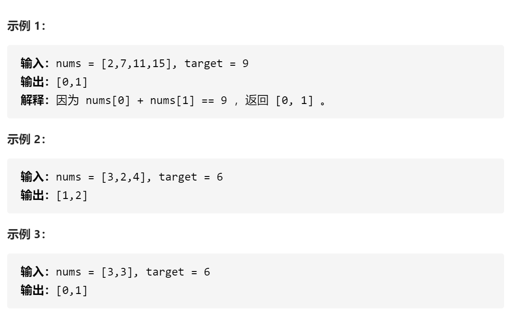

<!-- more -->

## Golang：简单表格驱动测试

在写一道 leetcode 的题目：[两数之和](https://leetcode-cn.com/problems/two-sum/)，
想要对它进行表格测试，就像我们提交代码那样测试，我们只测试结果:)
下面是该算法的一个答案：

```golang
func TwoSums(nums []int, target int) []int {
    dist := make(map[int]int)

    for index, num := range nums {
        if i, ok := dist[target - num]; ok {
            return []int{ i, index }
        }
        dist[num] = index
    }

    return []int{-1, -1}
}
```

如何对它进行表格测试，首先我们需要一个表格，类似于 Excel，那么这个类似 Excel 的东西就是数组，用 for 循环遍历，它会把一行一行的测试用例执行完，Go 在这方面很强大，不会因为某个测试失败而结束测试，而是会执行完所有测试。</br>

我们思考下需要一个怎么样的数据结构来组织我们表格，参考下 leetcode 上的输入和输出：

<center>
  
</center>
那我们的测试主要的输入和输出就有了如下结构体

```golang
struct {
    nums []int
    target int
    want []int
}
```

在 for 循环表格测试的时候，使用的 testing 包中的 Run 方法，该方法需要一个 name 和一个测试的 function，那我们的结构体又可以完整一下，如下：

```golang
struct {
    name string
    nums []int
    target int
    want []int
}
```

所以这个表格的样子就出来了：

```golang
cases := []struct{
    name string
    nums []int
    target int
    want []int
} {
    { "test not found", []int{1, 2}, 4, []int{-1, -1} },
    { "test found", []int{1, 2, 4}, 3, []int{0, 1} },
    ...
}
```

接下来就是用 for 循环遍历该表格测试：

```golang
for _, cc := range cases {
    t.Run(cc.name, func(t *testing.T){
        if got := TowSums(cc.nums, cc.target); !reflect.DeepEqual(got, tt.want) {
            t.Errorf("failed TowSums() want: %v; got: %v\n", tt.want, got)
        }
    })
}
```

完整代码如下

```golang
func TestTwoSums(t *testing.T) {
	cases := []struct {
		name   string
		nums   []int
		target int
		want   []int
	}{
		{"test not found", []int{1, 2}, 4, []int{-1, -1}},
		{"test found", []int{1, 2, 4}, 3, []int{0, 1}},
	}

	for _, cc := range cases {
		t.Run(cc.name, func(t *testing.T) {
			if got := TwoSums(cc.nums, cc.target); !reflect.DeepEqual(got, cc.want) {
				t.Errorf("failed TowSums() want: %v; got: %v\n", cc.want, got)
			}
		})
	}
}
```

由于用到了数组的对比，所以用了 reflect。

总结：Go 的表格驱动测试格式大致就是定义表格，for 循环执行测试，模板如下：

```golang
cases := []struct{
    name string
    xxx
    ...
    want xxx
}{
    {...}
    {...}
}

for _, cc := range cases {
    t.Run(cc.name, func(t *testing.T) {
        ...
    })
}
```
